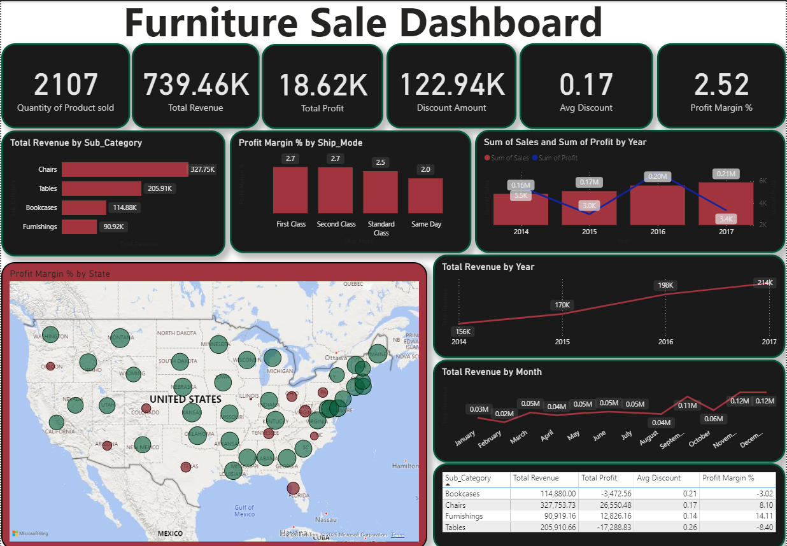
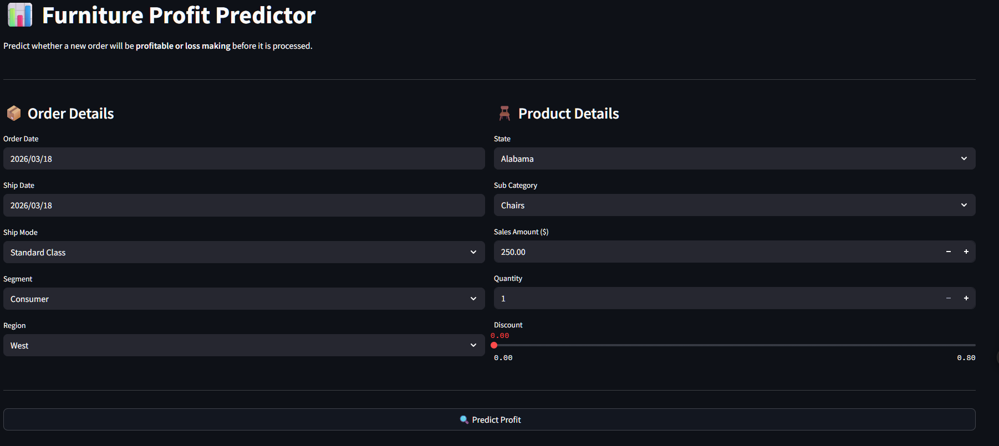

# 🪑 Furniture Profit Predictor

### An End-to-End Data Science Project — From Raw Data to Live Deployment

[](https://furniture-profit-predictor-cwtretmutq49qbpu3efwgy.streamlit.app/)
[](https://github.com/oyewolejerry2016/Furniture-profit-predictor)
[](https://www.linkedin.com/in/oyewole-jeremiah-9711a3231/)

---

## 📌 Project Overview

A furniture retail company was generating **$739K in revenue over 4 years** but keeping only **$18.6K in profit** — a razor thin margin of just **2.52%**. This project investigates why, uncovers the root causes through data analysis, and builds a machine learning model that predicts whether a new order will be profitable or loss making **before it is processed**.

---

## 🔴 The Business Problem

> *The business is selling more than ever but barely making any money.*

Key findings from the analysis:
- **$122,939** given away in discounts on $739K of sales
- **Tables** losing **$17,288** despite $205K in revenue (-8.40% margin)
- **Bookcases** losing **$3,472** despite $114K in revenue (-3.02% margin)
- **2017** showed the highest sales ever recorded but profit nearly collapsed to zero
- **Florida, Texas and West Virginia** are the worst performing states geographically

---

## 📊 Dashboard



The Power BI dashboard tells the complete business story across 8 visuals:
- KPI cards — Total Revenue, Profit, Discount Amount, Average Discount, Profit Margin %
- Revenue by subcategory
- Profit Margin % by shipping mode
- Sales vs Profit trend by year
- Revenue trend by year and month
- Profit Margin % by state (bubble map)
- Subcategory breakdown table (Revenue, Profit, Discount, Margin %)

---

## 🤖 Machine Learning Model

### Model: XGBoost Regressor
Predicts the **profit amount** for any new furniture order based on order characteristics.

### Model Performance

| Metric | Score |
|---|---|
| R² | 0.7829 |
| MAE | $28.60 |
| RMSE | $70.96 |

### Top Features Driving Profit
1. **Discount** — by far the most important feature (0.37 importance score)
2. **Is_Discounted** — whether any discount was applied at all (0.18)
3. **Discount_Amount** — actual dollar value of discount given (0.13)
4. **Sales** — total order value (0.09)

---

## 🌐 Live Web App



**Try it live:** [furniture-profit-predictor.streamlit.app](https://furniture-profit-predictor-cwtretmutq49qbpu3efwgy.streamlit.app/)

The Streamlit app allows business users to:
- Input a new order (subcategory, region, sales amount, discount etc.)
- Get an instant profit prediction in dollars
- See the predicted profit margin %
- Get a clear Profitable ✅ or Loss Making 🚨 status

---

## 🗂️ Project Structure

```
Furniture-profit-predictor/
    ├── Profit_predictor_app.py       ← Streamlit web app
    ├── Profit_prediction.py          ← Local deployment script
    ├── profit_prediction.ipynb       ← Full ML notebook
    ├── profit_prediction_model.pkl   ← Saved XGBoost model
    ├── label_encoder.pkl             ← Saved label encoder
    ├── sales_forecasting.csv         ← Cleaned dataset
    ├── furniture_dashboard.png       ← Power BI dashboard screenshot
    ├── Streamlit_dashboard.png       ← Streamlit app screenshot
    ├── requirements.txt              ← Python dependencies
    └── README.md                     ← Project documentation
```

---

## 🛠️ Tech Stack

| Tool | Purpose |
|---|---|
| SQL (SQL Server) | Data cleaning and exploration |
| Power BI | Dashboard and business intelligence |
| Python | Machine learning and deployment |
| Pandas / NumPy | Data manipulation |
| Scikit-learn | Model evaluation and preprocessing |
| XGBoost | Profit prediction model |
| Streamlit | Web app deployment |
| GitHub | Version control and hosting |

---

## 🔄 Project Workflow

```
Raw Data (CSV)
      ↓
SQL Data Cleaning
(Nulls, Duplicates, Outliers, Zero Sales)
      ↓
Power BI Dashboard
(8 Visuals, Business Insights)
      ↓
Python Feature Engineering
(Date features, Discount features, Sales features)
      ↓
XGBoost Model Training
(Hyperparameter tuning, Feature selection)
      ↓
Model Evaluation
(R²: 0.7829, MAE: $28.60)
      ↓
Streamlit Web App
      ↓
Live Deployment 🌐
```

---

## 📈 Key Insights

1. **Discounting is the #1 profit killer** — the top 3 most important model features are all discount related
2. **Tables and Bookcases are loss making** — the business loses money on every Table and Bookcase sold
3. **Chairs and Furnishings carry the business** — Furnishings has the healthiest margin at 14.11%
4. **Q4 is critical** — October, November and December generate 3-4x more revenue than Q1
5. **2017 is a red flag** — highest sales year but profit nearly collapsed

---

## ⚙️ How to Run Locally

**1. Clone the repository:**
```bash
git clone https://github.com/oyewolejerry2016/Furniture-profit-predictor.git
cd Furniture-profit-predictor
```

**2. Install dependencies:**
```bash
pip install -r requirements.txt
```

**3. Run the Streamlit app:**
```bash
streamlit run Profit_predictor_app.py
```

**4. Run the local prediction script:**
```bash
python Profit_prediction.py
```

---

## 👤 Author

**Oyewole Jeremiah Oladayo**

[](https://www.linkedin.com/in/oyewole-jeremiah-9711a3231/)
[](https://github.com/oyewolejerry2016)

---

## 📄 License

This project is open source and available under the [MIT License](LICENSE).
